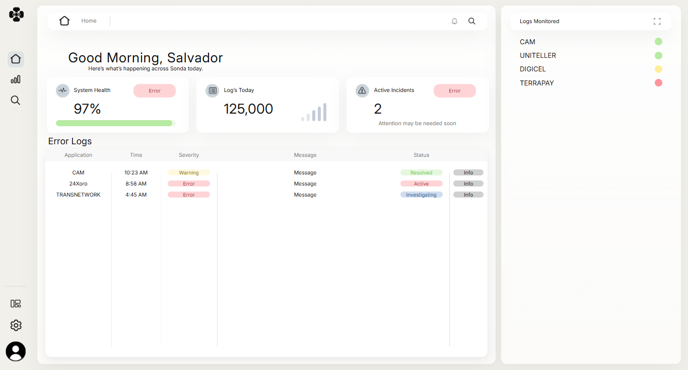
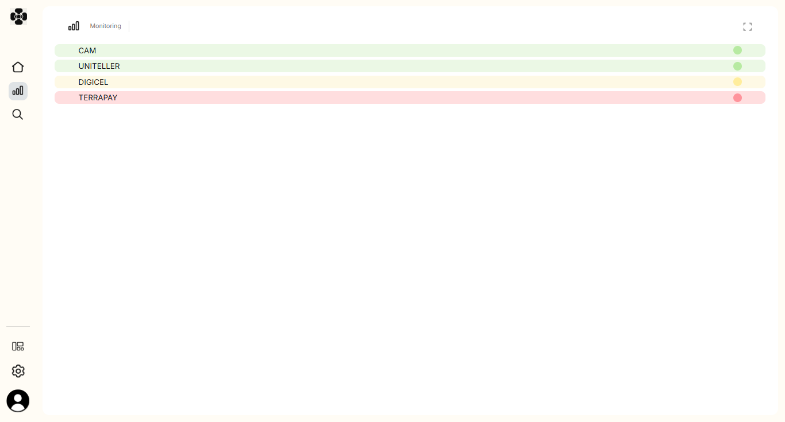
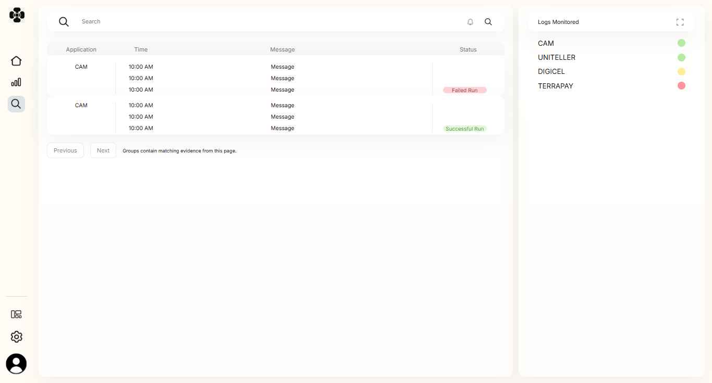

# SONDA by UNIO

A configurable application-log monitoring platform that turns log evidence into Application Runs, Order Runs, and actionable incidents.

**In development:** the backend and durable interpretation engine are implemented; the frontend is undergoing integration and visual acceptance. SONDA is not presented as production-deployed.



## What it does

- Interprets log formats through configurable Profiles rather than application-specific phrases embedded in code.
- Groups evidence into application cycles and order attempts, keeping Success / Failure / Undefined separate from incident workflow status.
- Tracks repeated incident occurrences, manual investigation, and successful recovery without losing history.
- Persists processing receipts and domain facts in PostgreSQL for transactional replay and duplicate prevention.
- Provides team-scoped Admin/member access, Profile validation and simulation, dashboard queries, and investigation workflows.
- Includes React Home, Monitoring, and Search screens with grouped evidence and detail dialogs.

## Architecture

A modular monolith using **C# / .NET 10, ASP.NET Core, EF Core, PostgreSQL, React, TypeScript, and Vite**.

```text
Configured log sources → acquisition worker → Domain/Application engine
                                                   ↓
                                        PostgreSQL durable facts
                                                   ↓
                                      authenticated ASP.NET Core API
                                                   ↓
                                             React frontend
```

The simulator and server use the same interpretation engine. Persistence and acquisition are adapters around that behavior. See the [architecture guide](docs/architecture/README.md) for domain boundaries, schema, transaction design, and policy decisions.

## Screens

These captures use synthetic demonstration data. They show work in progress, not final visual acceptance.

| Monitoring | Search |
| --- | --- |
|  |  |

## Verification

The latest recorded local verification reports **398 passing backend tests**, including all **382 accepted regression cases**, plus **14 frontend unit tests** and **8 browser tasks**. PostgreSQL integration checks use a real disposable database. These are recorded results, not a claim that GitHub CI has run them.

See [test evidence and remaining work](docs/phase-6-progress.md) and the [screen integration review](docs/phase-6-screen-integration-review.md).

## Development

Prerequisites include the .NET SDK selected by `global.json`, PostgreSQL 18, Node.js/npm, and Chrome for the configured browser checks.

Build and test the frontend:

```sh
cd src/Sonda.Web
npm ci
npm run build
npm test
npm run test:browser
```

For the shared backend and database setup, follow the [backend runbook](docs/development/shared-backend.md). See [frontend development](docs/development/frontend.md) for serving built assets through ASP.NET Core and [local preview](docs/development/local-preview.md) for the disposable sample-data harness. Local credentials and database binaries are deliberately excluded from this repository; a fresh clone requires setup.

## Current limits

- Phase 6 remains incomplete. Search interaction corrections, Configuration reorganization, and broader workflow/visual acceptance are pending.
- Dedicated-identity SMB/UNC, disconnect/reconnect, installed Windows Service lifecycle, boot recovery, and service-account ACL verification remain environmental gates.
- No production deployment or real GiroSol access is claimed. Notifications and remote collectors are not implemented.

## Project references

- [Master specification](docs/reference/master-specification.txt)
- [Visual design guide](docs/visual-design-guide.md) and [approved Canva reference](docs/reference/canva-approved-design.md)
- [Development history and approval record](docs/development/project-history.md)

Canva defines the visual reference; the accepted domain model and regression tests define system behavior. Historical approval notes remain preserved in the development history rather than mixed into this project overview.
