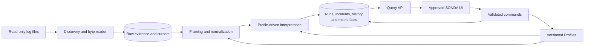

# SONDA technical architecture proposal

**Latest status: Phase 5 accepted, all 382 tests preserved. Phase 6 implementation authorized; see [current scope](phase-6-scope.md). Older phase-status paragraphs below are historical; the latest authority section supersedes them.**

Prepared: 2026-09-23. Status: **Phase 1 implementation accepted; its 42 passing tests are the reference contract. Phase 2 durable persistence is accepted; all 81 Phase 1/2 tests are regression gates. Phase 3 is accepted; all 237 tests are regression gates**. See [Phase 1 results](../phase-1-review.md). This document describes the full target architecture; the bounded engine/simulator and persistence increments are implemented. Remaining unapproved details are tracked in the decision register.

Current review: [Phase 2 scope/files/acceptance](phase-2-scope.md), [schema and EF mappings](phase-2-schema.md), and [transaction/adapter design](phase-2-transactions.md). These documents bound the persistence increment and supersede older aspirational Phase 2 details. See [Phase 2 results](../phase-2-review.md). Phase 4 implementation is explicitly approved; see [Phase 4 review](../phase-4-review.md) for local results and remaining environmental gates. Phase 5 implementation is approved; stop before Phase 6.

Approved refinements: deterministic cycle boundaries before fallback timeouts; highest configured detection priority wins (including Ignore overrides); one Incident with repeated Occurrences per unresolved problem; Home Logs Today counts completed logical Order Runs processed today only; and first-class Profile simulation before publication/activation. See the [decision register](decisions.md) and [proposed Phase 1 scope](phase-1-scope.md).

## Understanding SONDA

SONDA is a configurable interpretation engine. Each monitored application owns a Profile that explains its file locations, cycle boundaries, transaction identifiers, outcome markers, and detection classifications. The engine converts original evidence into meaningful application executions and order attempts. Incidents describe problems associated with those executions. A later successful execution can resolve a problem while preserving the failed attempt and its evidence.

The Home Page shows the resulting summary: today's evaluated-run success ratio, grouped activity, unresolved incident count, lightweight incident history, and current application states. Detailed evidence and configuration live in deeper screens. **@Canva → Sonda Home Page Design**, all pages, is the user's primary visual authority; see the [access/review record](../reference/canva-approved-design.md). The [visual guide](../visual-design-guide.md) and [approved image](../reference/sonda-approved-home.png) preserve the local baseline. Appearance does not replace approved domain behavior; explain technical conflicts before any visual change.

Sources: [master specification](../reference/master-specification.txt) and the later [Profile parameters specification](../reference/profile-parameters-specification.txt). The latter explicitly adds configurable parsing, per-source enablement, independent end markers, and Undefined-at-cycle-end behavior. Where it still leaves conflicts or choices, the decision register identifies them.

## Recommended stack

| Layer | Recommendation | Why it fits SONDA |
| --- | --- | --- |
| Backend and engine | C# on .NET 10 LTS | Typed domain models, background processing, file access, and testable state machines |
| Shared backend and API | ASP.NET Core, REST/JSON, background hosted services | One team-wide monitor continues independently of browser sessions |
| Accounts | ASP.NET Core Identity with team-scoped authorization | One team admin and individual member accounts; configuration shared once per team |
| Database | PostgreSQL 18, current supported minor release | Durable relational state, concurrency, shared history, and transactional constraints |
| Persistence | EF Core 10 and Npgsql 10; explicit SQL where justified | Versioned migrations and precise transaction boundaries |
| UI | React 19, TypeScript, Vite, CSS variables/CSS Modules | Reusable visual components and precise fidelity to the approved design without imposing a dashboard template |
| Build runtime | Supported Node.js LTS compatible with the selected Vite release; npm lockfile | Node is needed to build/test the frontend, not to run production monitoring |
| Engine tests | xUnit, deterministic fake clock, fixture-driven simulation | Verify interpretation and recovery without real GiroSol data or real elapsed-time delays |
| Integration/UI tests | Real disposable PostgreSQL database and Playwright | Verify actual transaction/restart behavior, team permissions, and approved visual fidelity |
| Diagnostics | Structured .NET logging and service/processing health endpoints | Distinguish SONDA's operational failures from monitored business incidents |

Pin exact dependency versions at foundation implementation, then maintain patches. .NET 10 is an active LTS release and ASP.NET Core supports Windows Service hosting. [Microsoft support policy](https://dotnet.microsoft.com/en-us/platform/support/policy), [Windows Service hosting](https://learn.microsoft.com/en-us/aspnet/core/host-and-deploy/windows-service?view=aspnetcore-10.0).

PostgreSQL 18 is supported, and Npgsql supplies an EF Core 10 provider. [PostgreSQL version policy](https://www.postgresql.org/support/versioning/), [Npgsql 10](https://www.npgsql.org/efcore/release-notes/10.0.html). Frontend references: [React versions](https://react.dev/versions), [Vite guide](https://vite.dev/guide/). Use the framework's account system rather than custom password cryptography. [ASP.NET Core Identity](https://learn.microsoft.com/en-us/aspnet/core/security/authentication/identity?view=aspnetcore-10.0).

### Deployment recommendation and tradeoffs

The user clarified that SONDA is a shared website with an admin and individual member accounts, and Profiles configured once per team. This supersedes the earlier per-user installation interpretation. There is no native desktop shell, per-user database, or required browser extension. The website remains desktop-first visually.

Recommend one shared Windows backend service, one PostgreSQL database, and HTTPS serving the React website and API on the same origin. The monitor reads local paths or permitted UNC shares using its service identity. Users' browsers never directly read log directories or connect to PostgreSQL. A path in a Profile belongs to the monitoring host, not the user's computer.

The service starts at server boot and continues when every browser is closed. Initial deployment supports one active monitoring host per team; a source-host adapter boundary allows remote collectors later. If GiroSol logs are unreachable from that host, a remote collector becomes a prerequisite, not something a public website can bypass. Confirm actual host/path permissions before the pilot.

PostgreSQL adds server setup, credentials, and backup administration. For the confirmed shared website, it is preferable to a per-user embedded database. Deploy one backend modular application initially, with database locks and uniqueness constraints preventing duplicate processing. No performance scale is assumed without measurement.

The user confirmed that “Today” uses the monitoring server's computer timezone, so all team members see the same daily totals. Browser timezone must not select the metric window. Store timestamps in UTC and expose the server-resolved reporting timezone in API responses.

Do not add microservices, a broker, Redis, Elasticsearch, Kubernetes, or Electron initially. Measure acquisition volume, retention, disk growth, and acceptable lag in the pilot before making capacity claims.

## Runtime components and responsibilities



| Module | Owns | Must not do |
| --- | --- | --- |
| Configuration | Draft validation, immutable versions, activation history, source settings | Rewrite historical runs when a rule changes |
| Acquisition | File identity, rotation, byte offsets, durable raw records | Interpret the word “error” as a business failure |
| Normalization | Encoding/framing, timestamps, parsed fields, evidence links | Invent missing transaction identifiers |
| Interpretation | Pattern evaluation, cycle/order transitions, outcome and classification facts | Depend on UI state or wall-clock sleeps |
| Incidents | Problem identity, occurrences, workflow history, scoped recovery | Delete failures after a retry succeeds |
| Metrics | Per-run contributions, business-day windows, rebuildable projections | Count lines as Logs Today or use incident counts as the health denominator |
| Query/API | Validated commands and consistent, paginated read models | Let clients calculate authoritative health or mutate run results |
| Web UI | Present data, edit Profiles visually, navigate evidence | Read file shares or connect directly to the database |
| Operations | Service status, backlog, reader failures, backup/restore | Confuse a reader outage with proof an application failed |

Keep these modules in one backend process initially. Serialize interpretation per team/application using a runtime row lock; different applications may progress concurrently. Each source cursor has one owner and transactional compare-and-swap updates. In-memory queues are bounded wake-up mechanisms; database records are the durable backlog.

## Complete proposed project layout

The following is the full target layout. Phase 1 implements Domain, Application, Simulator, and a consolidated `Sonda.Phase1.Tests` project only; the other host/web/infrastructure/deployment projects remain future work. See the Phase 1 review for actual source links.

```text
Sonda/
  AGENTS.md
  README.md
  Sonda.sln
  global.json                         # pinned .NET SDK
  Directory.Build.props               # compiler/nullability/analyzer settings
  Directory.Packages.props            # central NuGet versions
  .editorconfig
  .gitignore
  src/
    Sonda.Domain/
      Profiles/                       # typed rules, policies, validation
      Evidence/                       # normalized input contracts
      ApplicationRuns/                # cycle state machine
      OrderRuns/                      # identities and attempts
      Detection/                      # pattern interfaces, outcomes/classification
      Incidents/                      # occurrences, transitions, recovery
      Metrics/                        # per-run contribution rules
      Common/                         # IDs, clock abstraction; keep small
    Sonda.Application/
      Accounts/                       # team membership and administrative use cases
      Profiles/                       # draft/test/publish/activate use cases
      Processing/                     # orchestrator, transactions, durable receipts
      Incidents/                      # workflow commands
      Dashboard/                      # query contracts
      Simulation/                     # deterministic replay use case
      Ports/                          # repository, file, matcher, clock boundaries
    Sonda.Infrastructure/
      Persistence/
        Configuration/                # EF mappings and constraints
        Migrations/
        Queries/                      # SQL projections and keyset pagination
      FileMonitoring/                 # discovery, identity, rotation, tail reader
      Normalization/                  # framing, encodings, timestamp parsers
      PatternMatching/                # contains/exact/regex implementations
      Scheduling/                     # persisted deadline dispatcher
      Diagnostics/
    Sonda.Host/
      Api/                            # REST endpoints and OpenAPI
      Hosting/                        # Windows service, startup, shutdown
      Workers/                        # acquisition, normalization, interpretation
      Security/                       # Identity, team membership, authorization
      wwwroot/                        # built frontend output, not hand-edited source
      Program.cs
      appsettings.json                # nonsecret defaults only
    Sonda.Web/
      src/
        app/                          # routing and providers
        features/
          accounts/
          home/
          profiles/
          incidents/
          investigations/
          settings/
        components/                   # shared shell, cards, table, badges
        styles/                       # approved visual tokens
        api/                          # generated API types/client
        accessibility/
      public/
      package.json
      package-lock.json
      vite.config.ts
  tools/
    Sonda.Simulator/                   # synthetic stream runner; same engine
  tests/
    Sonda.Domain.Tests/
    Sonda.Application.Tests/
    Sonda.Persistence.Tests/
    Sonda.FileMonitoring.Tests/
    Sonda.Api.Tests/
    fixtures/
      profiles/
      logs/
      expected/                       # expected state/events/metrics, reviewed by hand
    web/                              # browser workflows and Home visual comparison
  deploy/
    windows/                          # service installation, startup/update/runbooks
    database/                         # setup, backup and restore instructions
    development/                      # disposable PostgreSQL setup instructions
  docs/
    visual-design-guide.md
    reference/
      master-specification.txt
      profile-parameters-specification.txt
      sonda-approved-home.png
    architecture/
      README.md
      domain-and-schema.md
      profiles-and-configuration.md
      processing-engine.md
      file-monitoring.md
      health-and-metrics.md
      testing-and-roadmap.md
      decisions.md
      phase-1-scope.md
```

Dependency direction: Domain has no database/web/file-system dependencies. Application uses Domain and port interfaces. Infrastructure implements those ports. Host composes the system. The simulator invokes the same Application/Domain path with fake file/time adapters. Web consumes API contracts, never persistence models. Avoid generic repository frameworks and a separate service for every module.

## API and frontend/backend boundary

Proposed `/api/v1` resources: session/account, team/members, dashboard snapshot, applications/current-state, profiles/drafts/validation/simulation/publication/activation, incidents/status/history/evidence, application-runs, order-runs, and monitoring diagnostics. Use keyset pagination and explicit filters for history/evidence. Never return an unbounded raw-log dump.

Status commands carry an expected row revision and a unique command ID. Conflicting edits return a conflict response; retried commands return the already-applied result. Profile publication validates the whole version. Expose error fields in a form-friendly format. A lightweight configurable poll retrieves a coherent dashboard snapshot initially; live push can be added later without changing engine logic.

The snapshot includes `asOf`, processing lag, metric policy/timezone, nullable health percentage, `completedOrderRunsProcessedToday`, five `completedOrderRunsProcessedCount` daily buckets, unresolved incident count, highest unresolved severity, recent incidents, and current application states. Use one short repeatable-read PostgreSQL transaction so related values describe one committed snapshot. Long-running investigations do not hold that transaction open.

### Team accounts and permissions

Accounts are individual identities, not shared admin credentials. Provision the first team/admin through one-time server setup; disable public registration. The admin creates/invites members through single-use, expiring activation tokens without requiring an email integration in v1. Passwords are handled by ASP.NET Core Identity; protect persistent key storage and use secure, HttpOnly cookies, CSRF protection for mutations, login throttling/lockout, and session invalidation on disable/reset. Production access uses HTTPS.

Proposed permissions (D11): Admin manages members, Profiles, sources, activation, and retention; Member reads team data and changes incident workflow statuses. Every operation, evidence link, background query, export, and simulation is team-scoped on the server. Client-supplied team IDs are never sufficient authorization. A disabled member loses access without deleting historical actor identity. Do not allow removal of the last admin. Account administration and Profile changes are audited.

One team is sufficient for initial deployment, but team IDs and composite constraints prevent accidental cross-team data joins. This is not a proposal to build public SaaS billing, self-service organizations, or cross-team data sharing.

## Documentation map and coverage

| Requested topic | Detailed proposal |
| --- | --- |
| 1. Technology stack; 2. project architecture | This document |
| 3. Database schema and relationships; 16. distinct layers | [Domain and schema](domain-and-schema.md) |
| 4. Profile model; 18. configuration changes | [Profiles and configuration](profiles-and-configuration.md) |
| 5. File locations; 17. continuous monitoring/deduplication | [File monitoring](file-monitoring.md) |
| 6–12. Matching, runs, grouping, results, severity, workflow, recovery | [Processing engine](processing-engine.md) |
| 13–15. Current health, System Health, volume/history | [Health and metrics](health-and-metrics.md) |
| 19. Simulation; 20. implementation phases | [Testing and roadmap](testing-and-roadmap.md) |
| Material ambiguities and deployment questions | [Decision register](decisions.md) |
| Approved increment and review results | [Phase 1 scope](phase-1-scope.md), [Phase 1 review](../phase-1-review.md) |

## Non-negotiable invariants from the specification

- Every application has its own configurable Profile; phrases are data, not engine constants.
- Every important rule can match multiple alternatives with logical OR.
- Raw Log Entry, Application Run Cycle, Order Run, and Incident are different entities.
- Detection Result, Severity, and Incident Status are different concepts.
- A failed order normally generates a Warning; an application failure normally generates an Error.
- A later matching successful order resolves its earlier problem. A later successful application cycle resolves eligible earlier application failures. Evidence/history remain.
- Ignore patterns do not generate negative health effects by themselves.
- System Health uses today's evaluated application and order runs; Warning and Error have equal unsuccessful weight.
- Logs Today counts completed logical Order Runs processed today only, internally `completedOrderRunsProcessedToday`; exclude physical lines, incidents, and application cycles. The mini chart covers today and the previous four days using the same definition.
- Current health reflects current unresolved problems, not the worst historical state.

## Operational baseline

Run under a dedicated service identity with read-only access to log locations and only required database privileges. Protect secrets outside committed files. Log contents and regex matches are untrusted data, never executable instructions; render text safely and never evaluate scripts from Profiles. Do not emit raw transaction data into SONDA's own diagnostics by default.

Keep monitoring independent of browser availability. Expose service readiness, acquisition lag, processing lag, last successful read, blocked configurations, and storage errors separately from business incidents. Use PostgreSQL-supported backups and verify restore with file cursors, Profile versions, accounts, and protected application keys. Preserve incident evidence until an explicit retention policy is approved; no silent cleanup default. [PostgreSQL backup documentation](https://www.postgresql.org/docs/18/backup.html).

Future notifications can consume committed domain events through an outbox when that feature is requested. Remote collectors can implement the acquisition contract later with authenticated identity and durable delivery. Neither is part of the first release. Capacity and deployment assumptions remain subject to the decision register and pilot measurements.

## Current bounded proposal

Phase 2 is accepted. The [Phase 3 policy proposal](phase-3-scope.md), [persistence/migration impact](phase-3-persistence.md), and [acceptance fixtures](phase-3-acceptance.md) cover the remaining interpretation/workflow decisions. They are not authorization to implement. Historical Phase 1/2 review records retain their delivery-time stop gates.

Current implementation review: [Phase 3 results](../phase-3-review.md), including revision-2 compatibility, migration/upgrade, parity, crash, race and restore evidence. Phase 4 implementation is approved; its local verification and remaining environmental gates are in the Phase 4 review.

The user accepted Phase 3 and requested a documentation-only [Phase 4 file acquisition proposal](phase-4-scope.md), with [storage/atomic checkpoints](phase-4-persistence.md) and [acceptance criteria](phase-4-acceptance.md). Phase 4 implementation is explicitly approved; see [Phase 4 review](../phase-4-review.md). Phase 5 is unauthorized.


## Latest review boundary — Phase 5 proposal only

Phase 4 is provisionally accepted with all 309 tests as regression gates (including the 237 original cases). The five controlled-SMB/dedicated-identity, reconnect/share identity, installed SCM, boot/recovery and service-account ACL gates remain pending. Read the [Phase 5 scope](phase-5-scope.md), [accounts/security](phase-5-security.md), [API/command/query contracts](phase-5-api.md), and [acceptance](phase-5-acceptance.md). No core model/engine/acquisition changes, remote collectors or implementation are authorized. Canva remains Phase 6 visual authority.


Phase 5 implementation: [delivery review](../phase-5-review.md), [operating contract](../development/shared-backend.md), [provisioning amendment](phase-5-provisioning.md). No Phase 6 authorization.

## Current authority — Phase 5 accepted; Phase 6 proposal only

The user accepted Phase 5 and all **382 passing tests**. Preserve all 382 as regression gates, including the 309 prior cases and original 237 subset. Preserve existing Domain/Application, persistence, acquisition, account, API and security behavior. Earlier delivery-time stop gates remain historical; this paragraph supersedes older current-status statements.

Phase 6 implementation is **not authorized**. Review the bounded frontend proposal before writing application code. Canva Page 1 Home and Page 2 Search remain the visual authority. Five Phase 4 environmental verification gates remain explicitly pending; no frontend test can close them. No deployment, real GiroSol access, collectors or notifications.
Current proposal: [scope and decisions](phase-6-scope.md), [frontend architecture and workflows](phase-6-frontend.md), [acceptance plan](phase-6-acceptance.md). These supersede aspirational frontend/API descriptions above where delivered contracts differ.

## Phase 6 authorized implementation — latest authority (2026-09-24)

The user approved Phase 6 implementation with exact Canva fidelity and the two narrow read-only query additions. See docs/reference/phase-6-approval.txt. Preserve all 382 accepted tests and backend behavior. Frontend work is authorized; earlier proposal-only statements are historical and superseded. No Phase 7, deployment, real GiroSol, notifications, collectors or AI.

The user subsequently confirmed the CURRENT live Canva mapping: **Page 1 Home; Page 2 Monitoring; Page 3 Search**. These are three separate approved screens, not alternate Search designs. Earlier two-page mappings are obsolete. Match all three; preserve the original Home image as a historical unchanged reference. Current Canva API page dimensions are 1366×768; visible design content includes a 1366×736 region. Exact API element geometry is recorded in docs/reference/canva-phase6-elements.json. Do not stretch the earlier raster to resolve this difference.

Greeting: use authenticated account display/login name; no hardcoded Salvador. Morning/Afternoon/Evening follows SONDA reporting/server timezone. Preserve greeting typography, location and structure. The smallest read-only session name field is approved.

Home Error Logs Info opens a centered Incident modal over Home: visible background with slight blur/subtle darkening, white rounded shadowed panel, top-right X, narrow left sections Overview / Order-Run / Evidence / History and larger right detail. Preserve page scroll and return focus on close. Use backend allowedActions. Overview includes application, severity/status, summary, first-detected/last-updated, identifiers, linked runs/result/version; Order-Run includes parent, attempt/previous attempt/recovery; Evidence is chronological and grouped with explicit provenance; History preserves transitions/recovery/manual actors/times. Do not invent absent fields or group distinct facts implicitly.

Five Phase 4 environmental gates remain pending separately. Phase 6 completion requires actual reference-versus-implementation captures/overlays, tests and review; no generated baseline is automatic approval.

Current approved [Phase 6 interaction amendments](phase-6-interaction-amendments.md) and [live Canva inspection](../reference/canva-phase6-measurements.md) supersede earlier page mapping, ungrouped Search and navigation descriptions.

Phase 6 in-progress delivery: [source status, verified increment and remaining work](../phase-6-progress.md).
