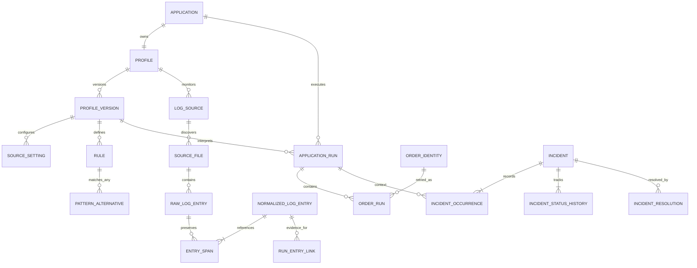

# Domain model and relational schema

Status: overall direction and five pre-implementation decisions incorporated; physical schema remains unimplemented and outside Phase 1. Read [decisions](decisions.md) for remaining unapproved policies. Transaction identifiers are scoped to their application/Profile and each detected attempt belongs to its Application Run Cycle.

## Separate concepts

| Concept | Meaning | Lifetime |
| --- | --- | --- |
| Raw Log Entry | Captured physical line and original bytes at a file position | Immutable evidence |
| Normalized Log Entry | Parsed logical message, possibly spanning physical lines | Immutable interpretation input under a parser version |
| Application Run Cycle | One application execution detected from configured boundaries | Open, then finalized with a result |
| Order Identity | Application/Profile-scoped business identifier | Connects attempts across cycles |
| Order Run | One attempt for an Order Identity within a particular cycle | Open, then finalized with a result |
| Incident | A tracked problem with one or more occurrences | Active, Investigating, or Resolved |
| Detection Result | Success, Failure, or Undefined | Outcome of a finalized run |
| Classification | Error, Warning, or Ignore | Meaning of a detection rule or outcome |
| Current Application Health | Stable, Warning, or Error | Derived from unresolved problems |

`Open` is an internal run lifecycle value (displayed as Running), not a detection result or incident status. An open run has a null result; only a finalized run has Success/Failure/Undefined. Do not label an ordinary in-progress order Undefined.

An Ignore rule creates an auditable rule match but no Incident. An Incident's severity can therefore be Error or Warning only. Classification fields support Ignore; workflow fields never do. A successful terminal marker and a separate warning detection can coexist; preserve both facts instead of overwriting the run result (see metrics and D04).

## Main relationships

Raw entries are not incidents. One cycle has many orders; one order attempt has many entry links. One entry may support its parent cycle and one explicitly correlated order. Ambiguous evidence remains unassigned instead of being attached to whichever order was seen most recently.

## Storage conventions

Physical target: PostgreSQL 18. Use UUID entity IDs; bigint byte offsets/counts/sequences; boolean flags; timestamptz instants normalized to UTC; date for reporting buckets; bytea original bytes; jsonb only for validated extensible settings/parsed fields; constrained text for domain enums. Avoid floating-point storage for health counts; calculate ratios at query time. Use explicit application-managed bigint revisions for optimistic concurrency.

Every owned configuration, source, run, incident, metric, and audit row carries `team_id`; all child references must preserve it. Accounts are global identities with team memberships. All runtime business facts also carry a `processing_session_id`; relationships must stay within a session and team. One active Live session per team represents normal operation. Phase 1 simulation uses isolated in-memory adapters; durable integration simulation later uses separate temporary databases. The session dimension makes isolated replays identifiable. A session records initial engine/policy version; receipts record the actual build after upgrades. Never combine simulation facts with live queries.

Every configuration/runtime child must reference the same application/Profile as its parent. Enforce this using composite candidate keys and foreign keys where IDs alone would allow cross-application mismatches. UUID uniqueness is not a substitute for relational checks. Restrict deletion of referenced published versions and business history.

## Accounts and ownership tables

| Table | Key fields and constraints |
| --- | --- |
| `team` | PK ID; unique key; display name; enabled; designated monitoring host; created time |
| `user_account` and Identity support tables | Framework-managed user ID, normalized login, password hash, security/concurrency stamps, lockout and token support; enabled flag. Never store plaintext passwords |
| `team_member` | PK(team ID, user ID); role=Admin/Member; active; created time. First deployment has one team admin plus members; last-admin removal is prohibited transactionally |
| `account_invitation` | PK ID; team; intended login/user; role; hashed single-use token; expiry; consumed time; creating admin. No public self-registration |
| `audit_event` | PK ID; team; actor user ID nullable for system; actor snapshot; action; entity ID/type; before/after revision or redacted diff; timestamp; operation ID |
| `monitoring_host` | PK ID; team; stable host key; OS identity; enabled; last heartbeat; observed OS timezone; collector mode=LocalService initially |

Individual members share team Profiles and incident history. Composite FKs `(team_id, entity_id)` plus authorization checks prevent cross-team linkage. Background jobs also receive an explicit team scope. Actor snapshots survive account deactivation; account deletion must not cascade into incident history.

## Configuration tables

| Table | Key fields and constraints |
| --- | --- |
| `installation_setting` | team PK/FK; installation UUID; timezone mode=`MonitoringHostLocal`; monitoring host FK; settings revision; display precision; retention policy nullable until approved |
| `application` | PK ID; team; application key unique within team; display name; description; enabled; created time; revision |
| `profile` | PK ID; unique FK application ID (one-to-one); stable profile key; active version nullable; pending version nullable; revision |
| `profile_version` | PK ID; FK profile; version number; Draft/Published; config schema version; engine compatibility; content hash; created/published time and actor; UNIQUE(profile, version number) |
| `log_source` | PK ID; team; FK profile; monitoring host FK; stable source key; archived flag; UNIQUE(profile, source key). Identity persists across setting versions |
| `source_setting` | PK(version ID, source ID); enabled; file or directory; canonical path; include/exclude patterns; recursion; encoding; framing policy; initial read policy; stream key; source timezone interpretation; polling and maximum record limits |
| `parsing_configuration` | PK/FK version; format mode; timestamp/message/level/metadata extraction definitions; timestamp format and culture; timezone/offset policy; framing rules; missing/ambiguous parse policies. Immutable and versioned; source may select a named parser variant within the version |
| `cycle_configuration` | PK/FK version; completion mode=TerminalMarker/ExplicitEnd; reliable-boundary mode; correlation mode; optional cycle extractor; unmatched/overlap policies; optional expected duration/grace and fallback policy; Undefined classification; success/failure/end rule keys. Timing is per Profile; no global business timeout |
| `order_configuration` | PK/FK version; identifier label; identity namespace; extraction/normalization policy; begin/success/failure/end rule keys; parent-close Undefined behavior; optional fallback timeout/grace when reliable boundary unavailable; Undefined classification; attempt/retry policy |
| `identifier_extractor` | PK ID; FK version; purpose=OrderIdentity/CycleCorrelation; position; type=Field/KeyValue/RegexCapture; definition; output name; normalization; alternatives policy |
| `rule` | PK ID; FK version; stable rule key; role=CycleBegin/CycleSuccess/CycleFailure/CycleEnd/OrderBegin/OrderSuccess/OrderFailure/OrderEnd/Detection; target scope; classification nullable for structural roles; explicit numeric priority; condition key; recovery policy; description; enabled; UNIQUE(version, stable key). No priority uniqueness index: equal priority is invalid only when enabled predicates compete for the same input/target |
| `pattern_alternative` | PK ID; FK rule; position; kind=Contains/Exact/Regex; expression; field target; case mode; regex options; UNIQUE(rule, position). Alternatives are OR |
| `profile_activation` | PK ID; profile; old/new versions; requested/applied time; actor; activation ID; reason |
| `activation_boundary` | PK(activation ID, source-file ID); final old-version complete-line byte offset; parser-drain checkpoint. Makes the cutover auditable |
| `profile_simulation` | PK ID; team/profile/draft version; draft hash; sample-set hash; engine/policy version; simulated clock/timezone inputs; report reference/hash; errors/warnings; created time/actor; reviewed hash/time/actor. Draft changes invalidate report applicability |
| `profile_simulation_sample` | PK ID; simulation FK; source label/context; evidence content/reference and checksum; encoding/date metadata. Isolated from live capture and governed by sample retention/access rules |

Published configuration rows are immutable. Draft versions may change using revision checks. Configuration is relational and typed; limited JSON text is allowed for validated extensible extractor/framing options. Canonical JSON exports are generated from these records, not a second mutable source of truth. Hash the export for audit and cache invalidation.

## Acquisition and processing tables

| Table | Key fields and constraints |
| --- | --- |
| `processing_session` | PK ID; team; Live/Simulation/Reprocess; parent session nullable; initial engine version; policy version; created time; completion time. At most one active Live session per team |
| `source_file` | PK ID; session; source; acquisition version; host identity; stable OS file identity if available; generation; current path; first/last seen; size/fingerprint; state. UNIQUE(session, physical file identity, generation) where reliable; paths are aliases, not identity |
| `source_file_alias` | PK ID; file ID; path; seen-from/to. Preserves rename history |
| `file_cursor` | PK/FK source-file ID; next committed byte offset; observed size; last-read time; revision. Cursor advances only with committed raw bytes |
| `raw_log_entry` | PK ID; file; acquisition version; start/end byte offsets; original bytes bytea; read time; line number optional; integrity hash; complete/oversize diagnostic flag. UNIQUE(file, start offset); end > start |
| `normalization_checkpoint` | PK(session, source-file); last consumed raw sequence; framing version; pending logical-frame references; deadline. Reconstructs partially assembled multiline entries |
| `normalized_log_entry` | PK ID; session; profile version; source/stream; parsed event time nullable; captured time; effective time; timestamp quality; message text; parsed fields; stable sequence; normalization outcome. UNIQUE(session, source-file, first raw position, framing version, output ordinal) |
| `entry_span` | PK(normalized entry, raw entry, span ordinal); byte/character span. Preserves original evidence for multiline framing |
| `processing_receipt` | PK(session, normalized entry); applied engine version; profile version; Applied/Unmatched/Quarantined; operation ID; applied time. Added atomically with domain effects |
| `application_runtime` | PK(session, application); next processing sequence; next cycle sequence; revision; effective/pending profile version; last-applied entry. Single application lane state |
| `rule_match` | PK ID; session; normalized entry; rule/version; matched alternative; target run IDs nullable; captures; priority snapshot; selection=Winner/Suppressed/Ambiguous; outcome=Matched/TimedOut/InvalidInput; winning rule reference/reason; occurrence key. Preserve all matches for simulation and audit |
| `run_deadline` | PK ID; session; exactly one application-run/order-run target; kind; due time; expected run revision; fired/canceled time; unique target+deadline generation |
| `monitoring_issue` | PK ID; source/application/session nullable; kind; details without unnecessary raw data; first/last occurrence; open/cleared; evidence references. Operational diagnostics, not a fourth incident severity |

Normalized records and receipts form a durable inbox. An application sequence is assigned deterministically when its lane accepts the input; store it rather than re-sorting old records by wall-clock time. Within a file, byte order is authoritative. Cross-file ordering and correlated cycles require the policies in D09.

## Runs, identities, incidents, and evidence

| Table | Key fields and constraints |
| --- | --- |
| `application_run` | PK ID; session/application/profile/version; stream key; cycle correlation key nullable; cycle sequence; lifecycle; result nullable; observed-success/observed-failure flags and evidence; start/end event times; start/finalize processing times; terminal reason; start/end entry IDs nullable; evaluated revision. UNIQUE(session, application, cycle sequence) |
| `order_identity` | PK ID; application/profile; identity namespace; normalized identifier TEXT; optional scope value reserved for future approved policies; UNIQUE(application, profile, namespace, scope value, normalized identifier). Empty scope is explicit, not NULL |
| `order_run` | PK ID; session; application-run FK; identity FK; attempt number; lifecycle; result nullable; start/end evidence and event times; completed_processed_at nullable until finalization; terminal reason; revision. UNIQUE(application-run, identity, attempt number) |
| `run_entry_link` | PK ID; normalized entry; exactly one application-run/order-run target; evidence role; unique entry+target+role. An entry can have two separate links for a cycle and its order |
| `incident` | PK ID; session/application/profile; scope=Application/Order; stream/recovery namespace; order-identity FK nullable; stable condition key; episode number; severity=Error/Warning; status=Active/Investigating/Resolved; opened/last-seen/resolved time; current resolution method nullable; revision |
| `incident_occurrence` | PK ID; incident; application-run nullable only for explicitly application-scoped diagnostics outside cycles; order-run nullable; rule-match nullable; severity snapshot; result snapshot nullable while unevaluated; detected event/capture/processing time; application sequence; deduplication key unique within session. Repeated failure attempts add occurrences, not duplicate evidence |
| `incident_evidence` | PK(occurrence, normalized entry); evidence role. Entire run evidence remains available through run links |
| `occurrence_recovery` | PK occurrence ID; successful application-run/order-run references with exact scope checks; recovery ordering point; recovered time; policy. Records recovery of old occurrences even if a newer occurrence keeps the episode open |
| `incident_status_history` | PK ID; incident; sequence; from status nullable only for creation; to status; actor kind/key/display snapshot; command/operation ID; reason; UTC time. UNIQUE(incident, sequence) and deduplicated command operation |
| `incident_resolution` | PK ID; incident; status-history FK; method=Automatic/Manual; resolving application-run FK nullable; resolving order-run FK nullable; resolved time; rule/policy version; reason. Automatic recovery must identify its successful run |
| `command_receipt` | PK command ID; command kind; request hash; result/reference; committed time. Same key with different payload is rejected |

Application and order run lifecycle checks: Open implies result and finalized time are NULL; Finalized requires a result and finalized time. An order attempt's Profile and application must match its cycle. Its identity is scoped to that same Profile. An application run holds the Profile version that interpreted it permanently.

Incident scope checks: Order requires an order identity and each occurrence's order run must have that identity; Application forbids an order identity. Outcome incidents require the originating run. An explicitly application-scoped diagnostic outside a cycle requires a rule match/evidence and no fabricated run. Automatic order resolution references a matching successful attempt; application resolution references an eligible later successful cycle/sequence under its configured policy. Cross-profile and cross-session resolutions are forbidden. A resolved incident requires a resolution/history record; enforce the multi-table invariant in the transaction layer and integration tests (a simple CHECK cannot inspect another table).

Approved invariant D05: one unresolved Incident per scoped problem; repeated failed attempts append distinct Occurrences and later successful retry is preserved through `incident_resolution` and its successful run/evidence. Enforce with a partial unique index on `(session, application, profile, scope, recovery namespace, order identity or explicit empty key, condition key)` for unresolved rows. Different problem identities remain separate. Proposed follow-up behavior for failure after resolution is a new episode; core repeated-failure grouping no longer awaits approval.

## Metric and current-state tables

| Table | Key fields and constraints |
| --- | --- |
| `run_metric_fact` | PK ID; session; exactly one application-run/order-run FK; evaluated instant; finalized result; healthEligible; healthSuccessful; classification summary; metric policy version; source revision. One fact per finalized run per policy, not per incident |
| `completed_order_run_processing_fact` | PK ID; session; required finalized Order Run FK; completed_processed_at (first committed completion processing); source completed_event_at separate; policy version; UNIQUE(session, order-run). No cycle/raw-line/incident target allowed |
| `daily_metric` | PK(session, application, local date, timezone epoch, metric policy); eligible/successful/unsuccessful/undefined health counts; completed_order_runs_processed_count; source watermark; rebuilt time. Derived and replaceable |
| `application_current_state` | PK(session, application); Stable/Warning/Error; unresolved counts by severity; highest severity; last evaluation; last sequence; revision. Derived and replaceable |
| `timezone_epoch` | PK ID; OS timezone ID; resolved rules/version or offset-boundary metadata; detected time; projection revision. Allows deliberate rebuild on timezone change |

Timezone epochs are scoped to the team's designated monitoring server. The user explicitly chose that computer's timezone, not each viewer's browser timezone.

Do not store the health percentage as the authoritative value. Preserve counts and source run links. Do not turn incident resolution into an UPDATE that changes a failed run to Success. Metrics must remain reconstructable from run and detection facts.

## Index and integrity plan

- Acquisition: unique physical file generation; unique raw start offset; unnormalized raw sequence; unprocessed normalized sequence by application.
- Runs: application + cycle sequence; open-cycle lookup by correlation key; identity + cycle/attempt; finalized instant for time-window queries.
- Incidents: unresolved problem identity; application/status/severity; detected time + ID for pagination; resolution/history by incident + sequence.
- Evidence: both directions of span/run/occurrence links; source file + offset for forensic navigation.
- Metrics: session + evaluated instant; one fact per run; daily bucket key.
- All required foreign keys indexed where they drive joins. Start without a full-text index or raw-message indexes until query evidence justifies them.
- Use deletion restrictions for published configuration, referenced evidence, runs, incidents, and histories. Archive applications/sources instead of cascading away business history.

## Transaction and migration boundaries

Acquisition commits raw records and their byte cursor together. Normalization commits framed input, evidence spans, and its checkpoint together. Interpretation commits the receipt, state transitions, incidents/history/resolutions, metric facts, current state, and deadline changes together. UI workflow commands take the same application/incident locks in a documented fixed order. No database transaction remains open while waiting for more file bytes, user input, or a long regex evaluation.

Match outside the write transaction against an immutable Profile version, then lock the application runtime row and validate expected application/run revisions when committing; recalculate on a conflict. Use Read Committed plus explicit row locking and uniqueness constraints for writes; use short Repeatable Read snapshots for dashboard queries. Retry deadlocks/serialization conflicts as whole idempotent commands, not partial SQL statements. Acquire application, run, and incident locks in consistent order.

Schema migration runs as an explicit deployment step with ingestion paused, a migration lock, and a verified backup. Only the migration identity has schema-changing privileges. An upgrade failure must leave an actionable recovery path; do not attempt silent downgrades. PostgreSQL's [transaction isolation](https://www.postgresql.org/docs/18/transaction-iso.html) and [constraints](https://www.postgresql.org/docs/18/ddl-constraints.html) support this design; the application must still enforce its cross-table business invariants.
