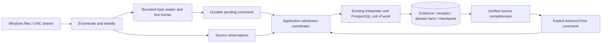

# Phase 4 proposal: production file acquisition and continuous ingestion

Status: **approved for implementation by the preserved Phase 4 approval**. See [implementation review](../phase-4-review.md) for verified behavior and remaining capability gates. The user accepted Phase 3 and all its evidence. All **237 tests are regression gates**. This proposal responds to the preserved [Phase 4 request](../reference/phase-4-request.txt). Read with [storage and transactions](phase-4-persistence.md) and [acceptance matrix](phase-4-acceptance.md).

## Objective and boundaries

Connect local Windows files and accessible UNC shares to the existing Domain/Application/PostgreSQL pipeline. Deliver one Windows worker host, deterministic acquisition/framing, durable checkpoints, recovery after crashes, source observations, and conservatively generated deadline commands. Keep the modular monolith. The worker is an entry point into the same application, not a distributed service or second interpretation engine.

Do not add frontend/Home/Search, accounts/auth UI, HTTP API, notifications, billing, remote collectors, queues, Redis or other infrastructure. Service packaging and a disposable-host service lifecycle test are included; installing on a production host or accessing a real GiroSol location is a separately authorized pilot action. Production deployment and real-source access remain separately gated. Canva → **Sonda Home Page Design**, Page 1 Home and Page 2 Search, remains the permanent visual authority, unchanged.

The invariant is:

> A durable file checkpoint never exceeds the contiguous byte ranges whose raw evidence and processing disposition have committed in PostgreSQL. Interpretation effects and checkpoint advancement commit together.

No checkpoint update happens in a separate post-COMMIT file write. Observed file length, volatile read-ahead position, candidate bytes and committed offset are different values. Reading is at least once; each admitted physical record has one durable interpretation receipt/effect set. The guarantee does not recreate bytes a producer overwrote or deleted before SONDA could read them.

## Acquisition architecture

Use a .NET 10 Worker/Generic Host with Windows Service integration and graceful cancellation. It runs independently of browsers. This hosting model is supported by [Microsoft's Windows worker guidance](https://learn.microsoft.com/en-us/dotnet/core/extensions/windows-service).

Periodic bounded reconciliation is authoritative for discovery. FileSystemWatcher is an optional wake-up hint: coalesce events and rescan after watcher failure/overflow; never create identities, skip data or advance offsets from an event alone. Microsoft's [FileSystemWatcher documentation](https://learn.microsoft.com/en-us/dotnet/api/system.io.filesystemwatcher?view=net-10.0) describes notification buffering/overflow and network/local use.

### Source configuration

Each existing Log Source gets a stable ID and immutable acquisition revisions, distinct from interpretation Profile Versions. Proposed fields:

| Field | Proposed meaning/default |
|---|---|
| Owner | Team, Application, Profile and stable source key; no implicit cross-Profile routing |
| Root | Absolute local path or UNC server/share path; no mapped drive dependence |
| Include/exclude patterns | Restricted filename/relative-path glob syntax (`*`, `?`, explicit recursive option); ordinal normalized matching, no executable expression |
| Recursive | False by default; never follow reparse points outside the allowed root |
| Enabled | Disabled sources retain checkpoints, generations, obligations and history |
| Required for availability | Separate from enabled; disabling a required source does not silently make it optional |
| Encoding | Explicit UTF-8 default; UTF-16 LE/BE supported; BOM policy must agree |
| Record framing | Physical LF/CRLF lines; bounded maximum record bytes; multiline deferred |
| Rotation contract | Rename, new-file series or declared copy/truncate; archive discovery rules and reliable generation ordering where needed |
| Initial position | Beginning by default. Starting at end needs an explicit audited baseline decision and known boundary; no silent historical skip |
| Scheduling limits | Poll interval, byte budget, record budget, fairness order, retry backoff and maximum record size; operational settings, not business deadlines |
| Completeness contract | None by default, or validated producer watermark/sealed-segment contract with coverage and clock domain |

Suggested initial engineering limits: 64 KiB reads, at most 1 MiB read-ahead and 256 complete records per source visit, 1 MiB maximum record, 1-second reconciliation target with bounded backoff up to 60 seconds for unavailable sources. These are tunable proposal defaults, subject to fixture and pilot measurements; they never become Profile timeouts.

Several enabled sources can feed one Profile. Reject overlapping subscriptions to the same physical file within a team, including aliases/hard links discovered at runtime; designate one canonical source. This avoids interpreting the same physical record twice under different source keys. A copied export is not automatically a new source: rotation copies require explicit lineage as below. Intentional multi-Profile interpretation of one file is deferred.

Changing location/patterns/encoding/ordering creates an acquisition revision; old generations retain their framing revision. Disable stops new reads after the current transaction, not by discarding pending work. Re-enable resumes retained generations. Removing a source from availability does not clear an unresolved completeness gap. Changing source membership while runs are open requires drain or proof that the old source obligations remain covered. Compatible interpretation Profile activation still follows the accepted pinned-version rules.

## File identity and rotation algorithm

Path is a locator, not identity. Query identity through an open read handle. Prefer authority/volume identity plus Windows file ID; [FILE_ID_INFO](https://learn.microsoft.com/en-us/windows/win32/api/winbase/ns-winbase-file_id_info) documents volume serial plus 128-bit file identity for handle comparison. Scope remote identities to their tested server/share authority; do not assume all SMB appliances preserve them across reconnect/failover.

Assign a persistent SONDA file-object ID after reconciliation, and a new generation UUID when a new byte stream begins. An epoch distinguishes truncation on the same file object. Keep path aliases/history separately. Persist identity capability and bounded prefix/checkpoint-neighborhood fingerprints as continuity checks. Size/mtime/path/hash alone are not sufficient proof of physical identity. File ID reuse, replaced shares or ambiguous reconnects pause as `IdentityUncertain`, rather than attaching an old checkpoint by guess.

For each visit:

1. Enumerate within the allowed root and open read-only with compatible read/write/delete sharing. Validate final path/root containment and handle identity; compare saved generation metadata.
2. Reconcile known aliases/rotation lineage. Validate length and bounded continuity samples before seeking the last committed offset. Do not reread the full file each poll.
3. Read a bounded byte range; retain partial decoder/framer state only in bounded memory. Validate handle identity/continuity again if a rotation/mutation signal occurs. Commit complete records in order using the transaction protocol.
4. On ambiguity or a missing unread range, record an operational gap and block the relevant frontier. Never claim an empty backlog simply because the old path disappeared.

| Producer action | Proposed handling |
|---|---|
| Append | Same generation, resume committed byte position; unchanged files need no content scan |
| Rename rotation | Keep old generation and open handle; follow identity to its archive alias even if the alias no longer matches the active-file glob. Discover replacement as a new generation. Drain predecessor before successor for serial file series |
| Daily new file | Distinct object/generation, offset zero. Use configured date/sequence naming contract for series order; directory enumeration/mtime is not causal order |
| Delete/recreate | Different identity means new generation. Drain old open handle if readable; after restart, missing unread old bytes become an explicit gap, not fabricated success |
| Observable truncate | New generation, offset zero; old offset never moves backward. Preserve prior evidence. Lost unread tail is a gap |
| Copy/truncate | Treat copy as archive of the old generation only with producer sequence/manifest and verified byte-prefix lineage. Do not ingest the copied prefix as a fresh generation. Recover unread old bytes from proven archive ranges, then start truncated object's new epoch |
| Partial write | Hold incomplete final record/code unit; no interpretation and no checkpoint beyond the last complete line. Resume on append |
| Archive still writable | Retain it as unfinished; EOF is not a seal. Do not assume rename means writer closed its handle |

**Limit requiring explicit approval:** an arbitrary producer may truncate and regrow a file beyond the old offset between polls, even recreating sampled bytes. No read-only tailer can guarantee detecting every such history. Phase 4 supports detected copy/truncate and verified retained archives; strict lossless eligibility requires retained immutable generations or a producer generation/rotation contract. For unsupported/ambiguous cases, pause or report the limitation and withhold completeness, not silently promise losslessness. No content-hash deduplication across unrelated records: identical legitimate lines at different offsets remain separate evidence.

## Encoding and framing

Offsets count original bytes, including terminators, not characters or StreamReader positions. A physical record spans `[start,end)` including LF or CRLF; evidence stores exact bytes and decoded text without terminator. UTF-8 multi-byte characters, UTF-16 code units/surrogate pairs, split CRLF and split BOM must survive arbitrary read boundaries. Use strict decoding; malformed data or encoding conflict yields a retained operational diagnostic and a stalled checkpoint, not replacement characters silently changing patterns.

Resolve BOM at generation start only. Attach the leading BOM bytes to the first physical record's range so contiguous coverage begins at zero, while excluding them from text. A BOM-only file has no completed record/checkpoint advance. A later BOM is content or a framing error according to explicit configuration, never an invisible reset. Blank lines are physical evidence with a committed no-business-effect interpretation.

A live EOF does not terminate an unterminated line. After a producer-proven seal, an incomplete last line is still an anomaly by default; do not manufacture a terminator. An explicit future terminal-record policy would require its own approval. Over-limit lines stop with bounded memory and a diagnostic, never skip bytes. On restart discard volatile buffers and reread from committed offset; the re-read is bounded by partial-record/read-ahead limits. Multiline framing, compressed archives and arbitrary encodings are deferred.

## Ordering, catch-up and backpressure

One host, one active ingestion owner per Application; multiple Applications may run independently. One durable monitoring session per Application is reused across restarts (not one new session on every boot). This fits the existing application sequence and session-wide line uniqueness; Profiles in the same Application share admission order.

Preserve byte order within a generation, and proven predecessor order for a serial rotation series. Round-robin bounded source visits prevent starvation; persist the selected application command sequence before interpretation. Across independent sources, guaranteed order is durable admission order, not source-time sorting. It is replayable, but cannot reconstruct an unrecorded total order between independent writers. Correlation identifies a run, not temporal precedence: cross-file Begin/outcome dependencies require a configured producer sequence/series or must be rejected during pilot validation. Do not fix them with “latest cycle” heuristics or arbitrary wait windows.

Catch-up drains retained generations from committed offsets in bounded batches, without resetting IDs or creating synthetic runs. Full first discovery scans metadata, not entire file contents; reading bytes for backlog is necessary once. Delay timers throughout unknown/unread backlog. Database outage stops intake after bounded pending/read-ahead capacity; there is no unbounded in-memory queue. A fatal interpretation ambiguity commits its receipt/evidence once, then pauses that Profile's acquisition for review; it must not continue consuming all later lines into blocked dispositions.

Unreserved backlog is interpreted using the accepted activation/routing behavior at admission: open runs pin their old Profile Version; new runs use the active one. A durable pending command completes before an activation command can overtake it. File generation/framing version and interpretation Profile Version remain distinct. No historical reprocessing is added.

## Frontiers and deadline scheduling

Maintain two distinct concepts: **byte catch-up** (all enumerated high-water positions consumed) and **semantic completeness** (no earlier/equal relevant event can still arrive). EOF, file age, largest seen event timestamp, successful empty read, quiet period and wall-clock time prove neither future writer behavior nor undiscovered older files. A missing share, partial record, unknown rotation, pending command, disabled required source or rejected partition blocks completeness.

Default `CompletenessMode=None`: continuous ingestion and normal boundary-driven finalization work, but no autonomous `AdvanceTime` is emitted for that Profile. Report `DeadlineDeferred: CompletenessUnproven`; do not change the accepted deadline calculation or invent a timeout. This is the recommended safe default until the real GiroSol format is inspected.

Enable production deadline commands only with an explicit source contract, such as an immutable producer manifest/watermark asserting all relevant records through W across specified generations are flushed, or a sealed segment series with reliable sequence and coverage-through time. A seal alone without time coverage is insufficient. This acquisition metadata does not introduce GiroSol phrases into the engine. The producer contract must cover future earlier-timestamp writes as well as currently unread bytes. A bounded-lateness heuristic is not proposed as strict proof; adding that weaker guarantee would need an explicit decision.

Build a durable frontier certificate containing the active source-set revision, per-source generation/high-water/watermark proofs, discovery epoch, minimum common coverage time, committed checkpoints and last admitted application sequence. Include all sources capable of affecting the run, including old-version obligations. In Phase 4 use a conservative Profile-wide barrier even for correlated partitions; no speculative per-partition progress.

Under the owner fence and application transaction lock, revalidate the certificate against unchanged membership, checkpoints, no pending earlier command, and no gap. An unknown/new generation or failed discovery invalidates an unused certificate. Choose effective time no greater than proven coverage and scheduler processing time. Set `ThroughSequence` to the actual prior application sequence and `PendingEarlierInputs=0` only after database verification. Commit certificate consumption and the existing AdvanceTime command atomically. Observed evidence at the boundary is processed before issuing the timer. Later contradictory evidence uses the accepted late policy; additionally record producer-contract violation and suspend subsequent frontiers.

The scheduler wakes to inspect persisted open-run deadlines, but its callback never finalizes a run. It submits the same deterministic command as the simulator after completeness is proved. Event-anchored and processing-anchored runs retain their original contexts. Because the accepted engine uses one frontier in the evidence-time domain as well, a processing-time timeout also requires a coverage contract valid for that domain; a caught-up byte scan is not a substitute. Clock rollback defers admission until processing time can remain nondecreasing; no silent rewritten source time. Store event, normalization, reservation/processing, completion-processing, effective deadline, commit audit and reporting timezone separately.

## Ownership, operations and security

Use a durable application-owner row with monotonically increasing fence epoch and renewable lease based on database time. Claims serialize under a row lock; every reservation, checkpoint, observation and interpretation transaction rechecks that epoch while locking the owner row. Take locks in owner → application runtime → source/generation/checkpoint order. Reclaim only after expiry; a stale reader may finish an OS read but cannot publish or advance anything. PostgreSQL row locks supply transaction ordering; [PostgreSQL locking documentation](https://www.postgresql.org/docs/18/explicit-locking.html) describes their scope and advisory-lock alternatives. No external lock service.

Start disabled until configured. On boot, load retained session/ownership/configuration, reconcile identity and recover pending commands before new work. On graceful stop, stop scheduling, allow a bounded current transaction to finish or roll back, cancel I/O, release handles and owner claim. On forced stop, rely on database atomicity and ownership expiry. Configure service recovery/restart policy without hot-looping on invalid configuration. Test start-at-boot behavior on an authorized disposable Windows host; do not install a production service during proposal work.

Run under a dedicated non-admin service account with read/list/traverse rights only on approved log directories/shares. Use its UNC identity; no impersonated browser credentials or mapped-drive reliance. Migration credentials are separate from restricted runtime database credentials. Store secrets outside repository/config artifacts (OS-protected configuration or deployment secret store); redact paths/raw contents in default diagnostics. Do not change producer ACLs, rename/delete source files, lock out writers or run log text as commands.

Record immutable operational events plus rebuildable status: reader state (`Disabled`, `Discovering`, `CatchingUp`, `Following`, `WaitingForPartial`, `Unavailable`, `IdentityUncertain`, `Gap`, `Blocked`), last enumeration/read success/failure, last committed evidence, observed/committed offsets, known bytes behind, partial bytes, pending command count/age, oldest known backlog event, lease owner/epoch, retries, active generation/config revision, and why deadlines are deferred. Unknown backlog is null/unknown, never zero. Empty successful reads refresh read availability but not business success. A successful directory listing alone is not a successful read of a required file.

Map accessible successful read/recovery to the existing source-success observation and missing expected file/access denied/share failure to source-failure observation. No-match policy is explicit (`RequiredContinuousFile` versus `PeriodicOptionalFile`); default missing required file is unavailable. Detailed error kind remains operational metadata. Staleness is calculated at explicit as-of time, not manufactured as an application Failure. Required disabled/uncovered sources cannot create a false Fresh display. Observations share ordered receipts and source-set provenance with evidence, while business health and System Health remain unchanged by reader errors.

No automatic purge. Retain generation/checkpoint identities, receipts, exact byte evidence, configuration, gaps and links needed by unresolved incidents, restart or idempotency. Source rotation retention belongs to the producer and must exceed offline/catch-up needs. Disk/database pressure pauses ingestion and exposes lag; it never deletes uncommitted input to keep up. Future retention needs an independent policy and proof that deduplication/recovery facts survive.

## Safe pilot and delivery sequence

1. After proposal approval, implement acquisition models and framing with synthetic byte streams; preserve all 237 gates.
2. Add forward migration, fenced admission and atomic checkpoint persistence; prove crash/retry and upgrade.
3. Add Windows/UNC readers, rotation reconciliation, bounded continuous loop and diagnostics.
4. Add completeness certificates and scheduler integration; safe no-watermark deferral is mandatory.
5. Verify real disposable local/SMB file tests, Windows service lifecycle, PostgreSQL parity, crashes, races and restore.
6. Prepare a pilot manifest for one user-selected GiroSol source: explicit root/files, encoding, rotation/retention, actual source timezone, sample-date derivation if timestamps omit dates, correlation/order guarantees, exact Profile Version and expected records. Do not guess a GiroSol path or log phrase.
7. With separate source-access authorization, first replay an approved read-only snapshot in an isolated pilot database, then bounded live read-only monitoring under that manifest. No production notifications or effects outside the pilot database. Compare manual Application/Order counts, outcomes, identifiers, Problem Identity, episodes, recovery, metric dates and late/ambiguous records. Record discrepancies; do not silently edit rules to match counts. If samples/access are unavailable, deliver pilot readiness and clearly mark live validation pending, not completed.
8. Deliver review artifacts and stop. Later UI/deployment work requires separate approval.

Approval of this proposal would cover implementation through controlled acceptance and pilot preparation, not permission to access unspecified real files or weaken completeness/rotation guarantees. The principal decisions for approval are conservative deadline deferral without producer proof, rejection of ambiguous copy/truncate identity, and one fenced Application owner.

