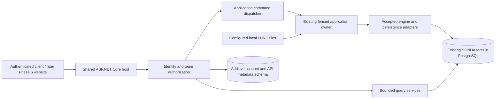

# Phase 5 approved scope — shared backend, accounts and secure APIs

Status: **Phase 5 implementation approved and delivered for review; Phase 6 remains unauthorized.** Prepared 2026-09-24 following provisional acceptance of Phase 4. Companion documents: [security and storage](phase-5-security.md), [API and command contracts](phase-5-api.md), [acceptance and delivery](phase-5-acceptance.md).

## Preserved plan and gates

SONDA remains a shared server application. Its local monitoring worker reads explicitly configured local/UNC sources directly. PostgreSQL is the durable source of truth. The accepted Domain/Application engine determines interpretation, runs, incidents, recovery and metrics. No remote collector, message broker, Redis, Elasticsearch, microservices or alternate processing engine is proposed.

Preserve **all 309 accepted tests**, including the original **237 Phase 1–3 cases**, unchanged as regression gates. Preserve core acquisition architecture, checkpoint model, interpretation semantics and persistence model. This increment adds an HTTP/access layer around them. Do not edit core migrations 001–003, their snapshot or the accepted exact-three-migration assertion to accommodate account tables.

Phase 4 is provisionally accepted, not fully capability-certified. These five environmental gates remain pending, independently of Phase 5 API tests:

1. Controlled SMB/UNC share under a dedicated identity.
2. Disconnect/reconnect and share identity behavior.
3. Installed Windows Service / SCM lifecycle.
4. Boot/recovery behavior.
5. Dedicated service-account ACL verification.

No mocked substitute can mark those gates passed. Their absence does not require a collector architecture. Synthetic local files and disposable PostgreSQL may support Phase 5 tests; real GiroSol access and deployment remain separately unauthorized.

**Phase 6 owns the frontend.** @Canva → Sonda Home Page Design, Page 1 Home and Page 2 Search, remains the permanent visual authority. Do not change that design or `visual-design-guide.md`. API DTOs supply semantic data rather than prescribe layout, colors, table density or new visual controls.

## Proposed increment

Deliver one ASP.NET Core 10 server entry point, JSON `/api/v1` endpoints, ASP.NET Core Identity accounts, team-scoped Admin/Member policies, secure cookie sessions, bounded queries and audited commands. Reuse the existing .NET/EF Core/Npgsql/PostgreSQL versions; no framework upgrade is part of this proposal.

The shared host composes HTTP and an in-process hosted monitoring coordinator around the existing file pump, scheduler and stores. Browser availability has no bearing on monitoring. The existing standalone `Sonda.Worker` remains available and retains its tests; do not start it concurrently with the shared host for the same application. Database fences remain authoritative if processes accidentally contend. This is host composition, not a change to acquisition or a remote worker protocol.



There is one local admission coordinator per application, holding the existing fence. It serializes file visits, deadline submissions and authorized HTTP commands at existing transaction boundaries. HTTP handlers cannot acquire a competing owner, invent sequence numbers or directly update incident/run/checkpoint rows. See the command protocol for crash and retry behavior.

## Bounded deliverables

| Area | Included |
|---|---|
| Host | JSON API, OpenAPI contract, middleware, composition with accepted worker, graceful shutdown, liveness/readiness |
| Accounts | Explicit first-admin bootstrap for an existing team; admin-created members; invitation redemption; password change/reset; disable/re-enable; Admin/Member role management; session revocation |
| Authorization | Deny-by-default endpoints, current team membership on each request, resource-scoped lookups, immutable server actor identity, last-admin protection |
| Dashboard | Coherent team snapshot; current business health plus availability; correct health/volume/history; unresolved count; recent Incident rows |
| Investigation | Applications, Application Runs, Order Runs, Incidents, Occurrences, recovery and status history; bounded evidence navigation |
| Profiles | List/detail; edit existing drafts; validation; first-class sample simulation/report; publish exact reviewed version; supported activation through existing admission |
| Incident workflow | Revision-2 supported manual transitions using the existing command engine and expected revision; history and capability responses |
| Search | Bounded persisted evidence search with exact structured filters and literal text; separate run/incident query resources |
| Monitoring | Role-filtered diagnostics from durable facts; current availability, backlog, checkpoints, ownership, pending/deferred reasons |
| Security/audit | HTTPS-oriented cookie/CSRF controls, rate and size limits, generic errors, append-only audit, durable operation identities, secret handling |
| Delivery | New HTTP/authorization/PostgreSQL integration tests, OpenAPI, account migration SQL, upgrade/restore and crash evidence, operations documentation |

## Deliberate boundaries exposed by existing code

These are the implemented boundaries, incorporating the approved [Admin provisioning amendment](phase-5-provisioning.md):

- **Narrow Admin provisioning is approved.** Create an Application, its inactive Profile Draft and allowed-root source configuration; then validate, simulate, publish and activate explicitly. The public workflow does not call the combined publish/activate harness. Accounts bootstrap still maps to an operator-created core Team. No general lifecycle CRUD or arbitrary session creation/deletion.
- **Revision-2 workflow only where supported.** `SubmitControlAsync` admits revision-2 status and activation commands. LegacyV1 evidence and reads remain supported unchanged. Do not expose `IncidentRevisionStore` (an internal test primitive) as a workflow service. Live LegacyV1 manual status/activation that lacks a supported public fenced adapter returns an explicit unsupported capability. No silent conversion to revision 2 or bypass of safe boundaries.
- **Monitoring diagnostics remain read-only.** Separate Admin source-configuration commands use the approved fenced/drained boundary and root allowlist. No path browsing, arbitrary reads, credentials, checkpoint edits, pending-row repair or force-recovery. Profile rule edits do not implicitly change acquisition configuration.
- **Immutable Profile history remains immutable.** Publication never reinterprets old evidence. Activation preserves pinned open runs, compatibility rules and pending-input order. Incompatible changes are surfaced as existing diagnostics/conflicts, not automatically resolved by the API.
- **No rewrite of core persistence to achieve web audit atomicity.** New access metadata can commit separately from existing domain transactions. An admitted operation's durable audit intent precedes dispatch; the existing receipt is authoritative for commit, and the access record is reconciled after an interrupted response. Never claim an atomic cross-context commit that current adapters do not provide.

These bounds allow useful team access without changing accepted business behavior or acquisition architecture. If implementation discovers that an endpoint cannot obey them, stop and report that specific conflict rather than changing a regression assertion.

## Proposed projects and files

```text
src/
  Sonda.Server/                       # new HTTP/host composition root
    Program.cs
    Hosting/ApplicationAdmission.cs  # local serialization, existing fence/store delegation
    Endpoints/{Session,Team,Dashboard,Profiles,Incidents,Search,Monitoring}.cs
    Security/{CurrentActor,TeamPolicies,SessionValidation}.cs
    Middleware/{ProblemDetails,RequestLimits,Correlation}.cs
  Sonda.Api.Contracts/                # versioned request/response DTOs; no EF/domain entities over HTTP
  Sonda.Access/                       # new Identity/access metadata adapter module, same database
    Identity/
    AccessDbContext.cs
    Operations/
    Audit/
    Simulations/
    Migrations/                      # separate schema and separate migration history
  Sonda.Application/                  # additive service/port files only
    Queries/{Dashboard,Investigation,Search,Monitoring}Contracts.cs
    Access/{ActorContext,AuthorizedCommand}Contracts.cs
  Sonda.Infrastructure/
    Queries/                         # read-only projections against accepted tables
tests/
  Sonda.Api.Tests/                    # actual HTTP pipeline and two-team authorization
  Sonda.Access.Tests/                 # real PostgreSQL account/migration/concurrency tests
  fixtures/phase5/                    # synthetic accounts, tenant collisions, API contracts
docs/
  architecture/phase-5-*.md
  development/shared-server.md        # after approval, verified setup and credential recovery
artifacts/phase5/                     # after implementation: OpenAPI, SQL, test/security/parity evidence
```

The approved projects and separate access migrations are implemented; see the delivery review. New access migrations use a separate context/history; core `SondaDbContext` remains unchanged. Shared-host wiring may call existing public acquisition methods, but must not refactor core processing merely for web convenience.

## Sequence and stop gate

1. Freeze API DTOs, permission policies and acceptance fixtures; record 309-test baseline.
2. Add access-only schema/migrations and bootstrap, sessions and account flows.
3. Add deny-by-default HTTP host and tenant-scoped read services.
4. Add coherent dashboard, investigation, bounded Search and diagnostic endpoints.
5. Add Profile simulation/publication and fenced supported workflow/activation adapters with audit/replay.
6. Prove isolation, revocation, concurrency, crash/retry, query parity, access upgrade/restore and unchanged regressions.
7. Deliver review evidence and stop. No Phase 6 frontend or production rollout without approval.

Completion means the [acceptance gates](phase-5-acceptance.md) pass and the exclusions remain true. It does not certify the five outstanding Phase 4 environmental capabilities.

